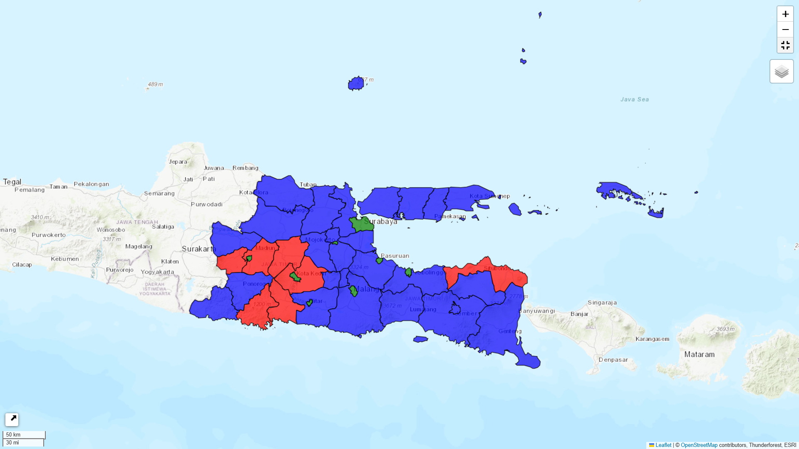

# Peta Interaktif Persebaran Sekolah di Jawa Timur

Ini adalah proyek visualisasi data berbasis web yang menampilkan peta persebaran sekolah di provinsi Jawa Timur. Seluruh logika dan tampilan peta dibangun menggunakan HTML, CSS, dan JavaScript dengan library utama Leaflet.js.

## Anggota Kelompok
1. **Aluf Maklufianzi Afif - 181221033**
2. **Ardian Purbo Laksono - 181221047**
3. **Ivan Adhipradana Putera - 181221052**
4. **Michael Sebastian - 181221076**

## Tampilan Peta

Berikut adalah tampilan dari file `index.html` ketika dibuka di browser.

## Deskripsi

Proyek ini bertujuan untuk menyajikan data geografis dalam format yang mudah dipahami dan interaktif. Peta ini secara spesifik menampilkan:
1.  **Batas wilayah Provinsi Jawa Timur**.
2.  **Titik-titik lokasi sekolah** yang tersebar di seluruh provinsi dengan penanda (marker) yang jelas.

Proyek ini murni merupakan aplikasi *front-end* dan tidak memerlukan *back-end* atau server untuk menjalankannya. Semua data dan logika pemetaan dimuat dan diproses langsung di browser pengguna.

## Fitur Utama

* **Peta Interaktif**: Pengguna dapat melakukan navigasi seperti *zoom in*, *zoom out*, dan menggeser (pan) peta.
* **Visualisasi Batas Wilayah**: Menampilkan poligon batas wilayah Jawa Timur yang dimuat dari file `jatim.geojson` untuk memberikan konteks geografis yang jelas.
* **Penanda Lokasi (Markers)**: Setiap sekolah direpresentasikan oleh sebuah titik penanda (marker) pada peta.
* **Kontrol Layer Peta Dasar**: Terdapat pilihan untuk mengganti tampilan peta dasar (*base map*) antara `OpenStreetMap`, `Thunderforest`, dan `ESRI Topo Map` melalui kontrol di pojok kanan atas.

## Penjelasan File

* `index.html`: Ini adalah file utama dan satu-satunya file HTML dalam proyek. File ini berisi:
    * Struktur dasar halaman web (HTML).
    * Styling (CSS), termasuk referensi ke Bootstrap.
    * Logika JavaScript untuk menginisialisasi peta Leaflet, memuat layer peta dasar, serta memuat dan menampilkan data dari file `jatim.geojson` dan data lokasi sekolah.
* `jatim.geojson`: Sebuah file dalam format GeoJSON. File ini berisi data koordinat yang membentuk poligon (area) dari provinsi Jawa Timur. JavaScript dalam `index.html` memuat file ini untuk menggambar batas wilayah di atas peta.

## Teknologi yang Digunakan

* **HTML5**
* **CSS3**
* **JavaScript**
* **Library:**
    * [Leaflet.js](https://leafletjs.com/): Library inti untuk semua fungsionalitas peta.
    * [jQuery](https://jquery.com/): Digunakan untuk mempermudah beberapa operasi JavaScript.
    * [Bootstrap](https://getbootstrap.com/): Digunakan untuk styling komponen UI.
    * [Leaflet.awesome-markers](https://github.com/lvoogdt/Leaflet.awesome-markers): Library tambahan untuk membuat ikon penanda yang lebih menarik.

## Cara Menjalankan

Proyek ini sangat mudah dijalankan karena tidak memerlukan instalasi atau server.

1.  Pastikan Anda memiliki semua file yang diperlukan (`index.html` dan `jatim.geojson`) dalam satu folder yang sama.
2.  Buka file `index.html` secara langsung menggunakan peramban web (web browser) modern seperti Google Chrome, Mozilla Firefox, atau Microsoft Edge.
3.  Peta akan langsung tampil dan siap untuk digunakan.
